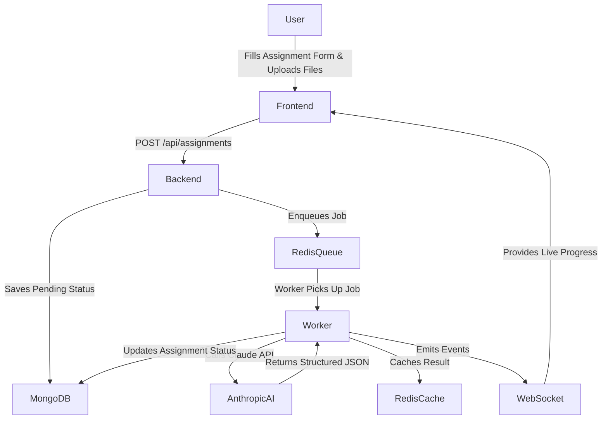

<div align="center">
  <h1>✨ Veda-AI</h1>
  <p><strong>Generate structured, professional question papers in seconds using AI.</strong></p>

  <!-- Badges -->
  <p>
    
    
    
    
    
    
    
    
    
  </p>
</div>

---

## 📸 Overview

**Veda-AI** is a full-stack application that empowers teachers and educators to effortlessly create assignments and generate AI-powered question papers. With real-time generation progress via WebSockets, structured outputs with difficulty tagging, and seamless PDF export, Veda-AI takes the heavy lifting out of exam preparation.

---

## ✨ Features

- **🚀 Real-time Generation Progress**: Watch the AI draft your exam live through WebSocket connections.
- **📁 Context-aware Uploads**: Upload PDF or TXT files to inject your own study material as context for the AI.
- **📊 Structured Formatting**: The AI prompt strategy enforces strict JSON parsing to ensure a highly organized output sorted by question sections (A, B, C...).
- **🏷️ Difficulty Enforcement**: Question papers are automatically structured to maintain an easy/medium/hard distribution.
- **📥 PDF Export & Print**: Ready-to-go `html2pdf.js` implementation allows for one-click downloading and printing.
- **🔄 Regenerate & Tweak**: Didn't like the AI's first draft? Re-queue generation with custom tweaks.

---

## 🏗️ Architecture Flow



### Technical Workflow

1. **Input Phase**: User fills the formulation form (subject, topic, question types, marks, difficulty) and optionally uploads a reference document.
2. **Submission**: Frontend dispatches a `POST /api/assignments` request with a `FormData` payload.
3. **Task Queue**: Backend stores the assignment in MongoDB and adds a **BullMQ** job to Redis.
4. **Processing**: Worker takes the job, parses file context (max 3000 chars), and strictly interfaces with the **Claude AI** model.
5. **Real-time Updates**: Throughout processing, the backend emits `generation-event` via `socket.io` to a room isolated to that specific assignment.
6. **Delivery**: The parsed JSON is cached (24h TTL) and stored in MongoDB. The frontend receives the completion event and renders the structured exam.

---

## 🚀 Quick Start

### Prerequisites
- Node.js 20+
- MongoDB (local or Atlas)
- Redis (local or Upstash)
- Anthropic API key (`claude-sonnet`)

### Option A: Docker (Recommended)

1. **Clone & Setup Environment**
   ```bash
   git clone https://github.com/SamarthKapdi/Veda-AI.git
   cd Veda-AI/vedaai
   cp backend/.env.example backend/.env
   # Make sure to edit backend/.env and add your ANTHROPIC_API_KEY
   ```

2. **Boot up via Docker**
   ```bash
   docker-compose up --build
   ```
   > 🌐 Visit: `http://localhost:3000`

### Option B: Manual Setup

**Backend**
```bash
cd vedaai/backend
cp .env.example .env
# Fill in ANTHROPIC_API_KEY, MONGODB_URI, REDIS_URL

npm install
npm run dev
# Backend runs on http://localhost:4000
```

**Frontend**
```bash
cd vedaai/frontend
cp .env.example .env.local
# Set NEXT_PUBLIC_BACKEND_URL=http://localhost:4000

npm install
npm run dev
# Frontend runs on http://localhost:3000
```

---

## 🔌 API Reference

| Method | Endpoint | Description |
|---|---|---|
| `POST` | `/api/assignments` | Create a new assignment & queue generation job |
| `GET` | `/api/assignments/:id` | Get assignment details & its current status |
| `GET` | `/api/assignments/:id/result` | Fetch generation results from Redis cache / MongoDB |
| `POST` | `/api/assignments/:id/regenerate`| Re-queue the AI generation process |
| `GET` | `/health` | Application health check endpoint |

### WebSocket Events

| Event Name | Direction | Payload Example |
|---|---|---|
| `join-assignment` | Client → Server | `{ assignmentId: "12345" }` |
| `generation-event`| Server → Client | `{ status: "progress/completed/failed", data: {...} }` |

---

## 📄 License

This project is licensed under the **MIT License**.